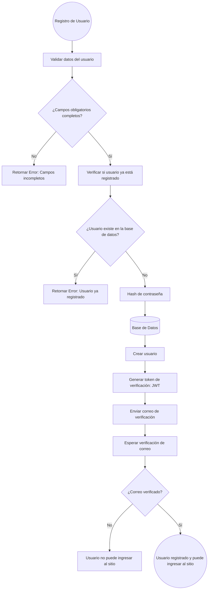
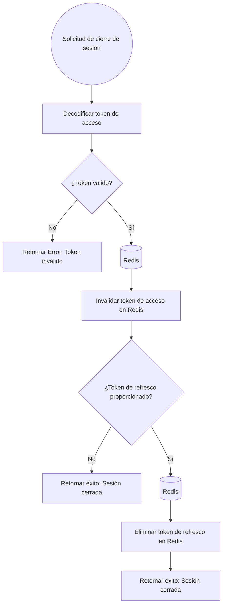
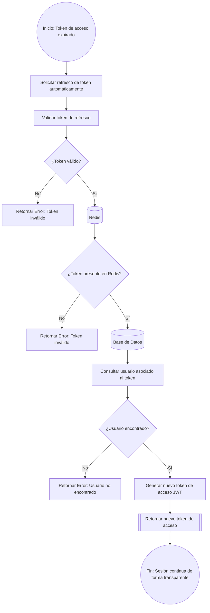
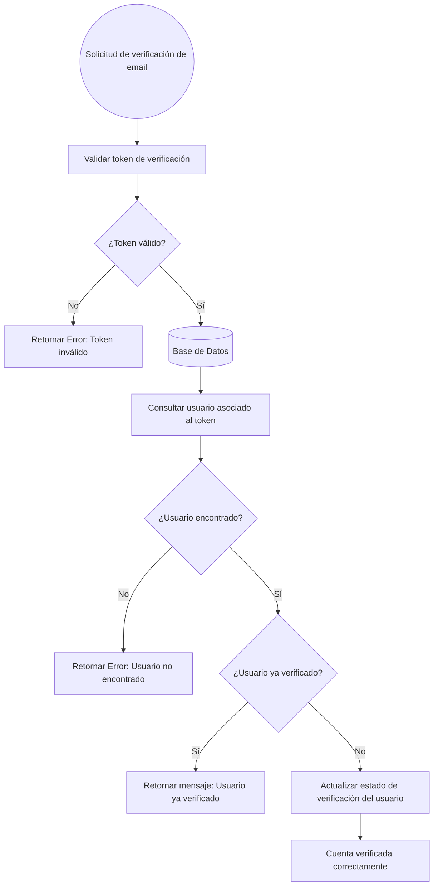
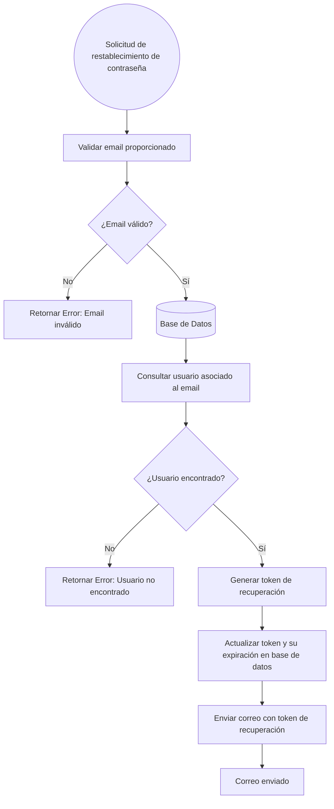
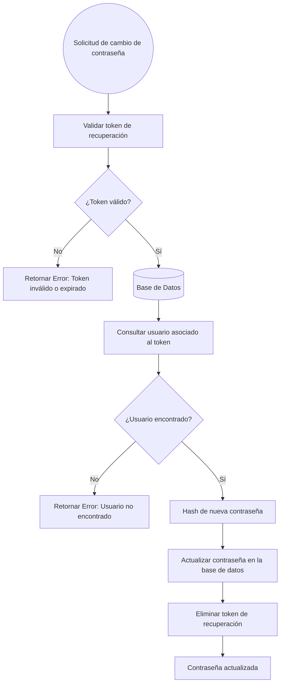

# Flujo de Autenticacion

## Registro de Usuario



## Inicio de sesion

```mermaid
flowchart TD
  A((Inicio de Sesion)) --> B[Validar datos del usuario]
  B --> C{¿Usuario existe en la base de datos?}
  C -->|No| D[Retornar Error: Credenciales inválidas]
  C -->|Sí| E[(Base de Datos)]
  E --> F{¿Cuenta verificada?}
  F -->|No| G[Retornar Error: Cuenta no verificada]
  F -->|Sí| H[Verificar contraseña]
  H --> I{¿Contraseña válida?}
  I -->|No| J[Retornar Error: Credenciales inválidas]
  I -->|Sí| K[Generar tokens JWT (Acceso y Refresco)]
  K --> L[(Redis)]
  L --> M[Almacenar token de refresco en Redis]
  M --> N[Retornar tokens y datos del usuario]
  N --> O((Redirigir al Home))
```

## Cerrar sesion



## Refrescar Token



## Verificar email



## Solicitud de Restablecimiento de Contraseña



## Cambiar contraseña


